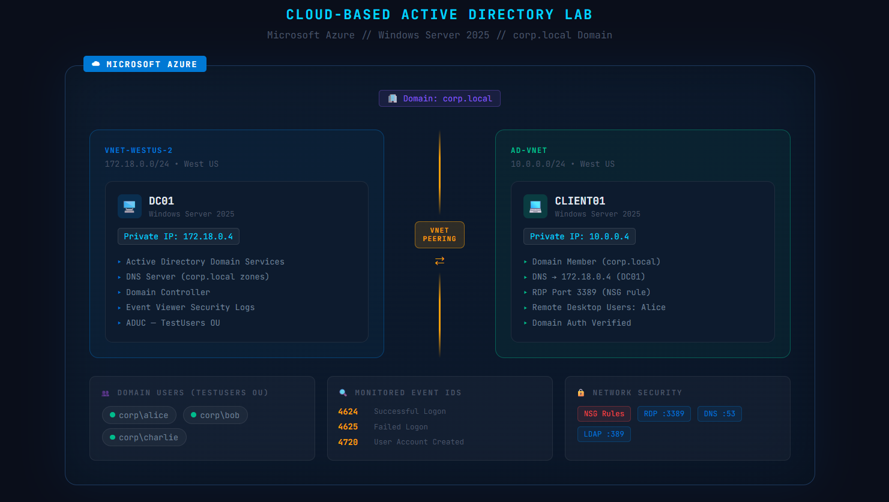

# Cloud-Based Active Directory & User Management Lab (Azure)



## Technologies Used

* Microsoft Azure (Virtual Machines, Virtual Networks, NSG)
* Windows Server 2025 Datacenter
* Active Directory Domain Services (AD DS)
* DNS Server
* Remote Desktop Protocol (RDP)
* Azure VNet Peering
* Windows Event Viewer (Security Logs)
* PowerShell & Command Prompt

---

## Introduction

In this project, I built a fully functional cloud-based Active Directory environment in Microsoft Azure, simulating a real-world enterprise network. I deployed a Windows Server 2025 Domain Controller (DC01) and a client machine (CLIENT01), configured a domain (corp.local), created and managed domain user accounts, and monitored authentication events using Windows Event Viewer — skills directly relevant to IT administration, help desk, and SOC analyst roles.

---

## Architecture Overview

```
┌─────────────────────────────────────────────────────────────┐
│                     Microsoft Azure                         │
│                                                             │
│  ┌──────────────────────┐     VNet Peering    ┌──────────────────────┐  │
│  │   vnet-westus-2      │◄───────────────────►│    AD-VNet           │  │
│  │   172.18.0.0/24      │                     │    10.0.0.0/24       │  │
│  │                      │                     │                      │  │
│  │  ┌────────────────┐  │                     │  ┌────────────────┐  │  │
│  │  │     DC01       │  │                     │  │   CLIENT01     │  │  │
│  │  │ Windows Server │  │                     │  │ Windows Server │  │  │
│  │  │    2025        │  │                     │  │    2025        │  │  │
│  │  │ 172.18.0.4     │  │                     │  │ 10.0.0.4       │  │  │
│  │  │                │  │                     │  │                │  │  │
│  │  │ • AD DS        │  │                     │  │ • Domain Member│  │  │
│  │  │ • DNS Server   │  │                     │  │ • RDP Enabled  │  │  │
│  │  │ • corp.local   │  │                     │  │                │  │  │
│  │  └────────────────┘  │                     │  └────────────────┘  │  │
│  └──────────────────────┘                     └──────────────────────┘  │
└─────────────────────────────────────────────────────────────┘
```

---

## Project Steps

### Step 1: Deploy Virtual Machines in Azure
- Created two Windows Server 2025 VMs: **DC01** (Domain Controller) and **CLIENT01** (Client Machine)
- Configured Network Security Groups (NSGs) to allow RDP access on port 3389
- Assigned public and private IP addresses to both VMs

### Step 2: Configure Active Directory on DC01
- Installed **Active Directory Domain Services (AD DS)** role on DC01
- Promoted DC01 to a Domain Controller for the domain **corp.local**
- Verified DNS zones were automatically created in DNS Manager
- Confirmed AD DS health using Server Manager

### Step 3: Configure Networking & Join Client to Domain
- Identified VNet mismatch between DC01 (vnet-westus-2) and CLIENT01 (AD-VNet)
- Configured **Azure VNet Peering** to enable cross-network communication
- Set CLIENT01's DNS server to DC01's private IP (172.18.0.4) using `netsh`
- Verified connectivity with `ping 172.18.0.4` — 0% packet loss confirmed
- Joined CLIENT01 to the **corp.local** domain via System Properties

### Step 4: Create & Manage Domain Users
- Opened **Active Directory Users and Computers (ADUC)** on DC01
- Created Organizational Unit **TestUsers**
- Created domain user accounts: **Alice**, **Bob**, and **Charlie**
- Configured user properties and group memberships

### Step 5: Configure Remote Desktop Access
- Opened System Properties on CLIENT01 (sysdm.cpl)
- Navigated to **Remote tab → Select Users**
- Added **CORP\alice** to the **Remote Desktop Users** local group
- Verified domain user RDP access to CLIENT01

### Step 6: Test Domain User Authentication
- Logged out of CLIENT01 administrator account
- Logged in as **corp\alice** using domain credentials
- Ran `whoami` in Command Prompt — output confirmed: `corp\alice`
- Tested network access by pinging DC01 (172.18.0.4) — successful

### Step 7: Security Monitoring with Event Viewer
- Opened **Event Viewer** on DC01
- Navigated to **Windows Logs → Security**
- Used **Filter Current Log** to identify key authentication events:

| Event ID | Description | SOC Relevance |
|----------|-------------|---------------|
| 4624 | Successful logon | Confirms valid user authentication |
| 4625 | Failed logon | Detects brute-force or password guessing |
| 4648 | Logon using explicit credentials | Indicates lateral movement attempts |
| 4720 | User account created | Tracks user provisioning |

- Exported Security logs as **DC01-SecurityLogs.evtx** for offline analysis

---

## Key Challenges & Solutions

| Challenge | Root Cause | Solution |
|-----------|-----------|----------|
| CLIENT01 couldn't RDP | No Public IP assigned | Dissociated existing IP and reassigned correctly |
| Domain join failed | VMs on different VNets | Configured Azure VNet Peering between vnet-westus-2 and AD-VNet |
| DNS not resolving | DNS still pointing to wrong IP | Used `netsh interface ip set dns` to manually set DNS to 172.18.0.4 |
| Trust relationship failed | Domain trust broken after network changes | Removed computer from domain and rejoined with fresh trust |
| Cannot add domain user to RDP group via GUI | Location defaulting to local machine | Used `net localgroup` via CMD to add CORP\alice directly |

---

## Skills Demonstrated

* **Cloud Infrastructure**: Deploying and managing Azure VMs, VNets, NSGs, and Public IPs
* **Windows Server Administration**: Installing AD DS, promoting Domain Controllers, configuring DNS
* **Active Directory Management**: Creating OUs, user accounts, group memberships
* **Network Troubleshooting**: Diagnosing VNet peering issues, DNS misconfigurations, and trust relationship failures
* **Identity & Access Management**: Domain joining, RDP access control, user authentication
* **Security Monitoring**: Reviewing Windows Security Event logs, filtering by Event ID
* **PowerShell & CMD**: Using `netsh`, `ping`, `whoami`, `net localgroup`, and `ipconfig` for diagnostics

---

## Platforms & Technologies

`Microsoft Azure` `Windows Server 2025` `Active Directory Domain Services` `DNS` `RDP` `VNet Peering` `NSG` `PowerShell` `Windows Event Viewer` `Identity & Access Management`

---
